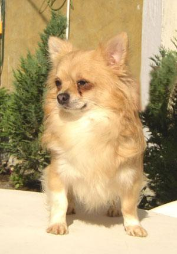

# Obejective
[Generative Dog Images](https://www.kaggle.com/c/generative-dog-images/overview)

The obejective of this capstone project is learning and using generative adversarial network (GAN) to generate creative dogs images. In this project, I will use training skills to train 20K dog files like Chihuahua, Japanese-spaniel, Pekinese, etc. Then training a generative model (GAN) to generative dogs image automatic.

# Motivation
Generative methods (in particular, GANs) are currently used in various places on Kaggle for data augmentation. Their potential is vast; they can learn to mimic any distribution of data across any domain: photographs, drawings, music, and prose. If successful, not only will you help advance the state of the art in generative image creation, but you’ll enable us to create more experiments across a variety of domains in the future.

# Dataset
There are 20579 dog image files as train file, the test file are 10,000 dog images sized 64x64 generated automatically by GAN.

## Sample Dog Image

# Things to Do
- Data exploring: (16004, 12288)
    There are some problems in the dataset:
  - There are pictures with more than one dog (even with 3 dogs);
  - There are pictures with the dog (-s) and person (people);
  - There are pictures with more than one person (even with 4 people);
  - There are pictures where dogs occupy less than 1/5 of the picture;
  
- Image processing
  - normalization
  
- GAN network building
  - define a generator with 3 hidden layers and define a discriminater with reverse layers to generator
  - generator struct: (100, 512) -> (512, 1024) -> (1024, 2048) -> (2048, 12288)
  - discriminator struct: (12288, 2048) -> (2048, 1024) -> (1024, 512) -> (512, 1)
  
- Parameters fitting 
  - batch_size = 100
  - lr = 0.0002
  
- Dog files generating
